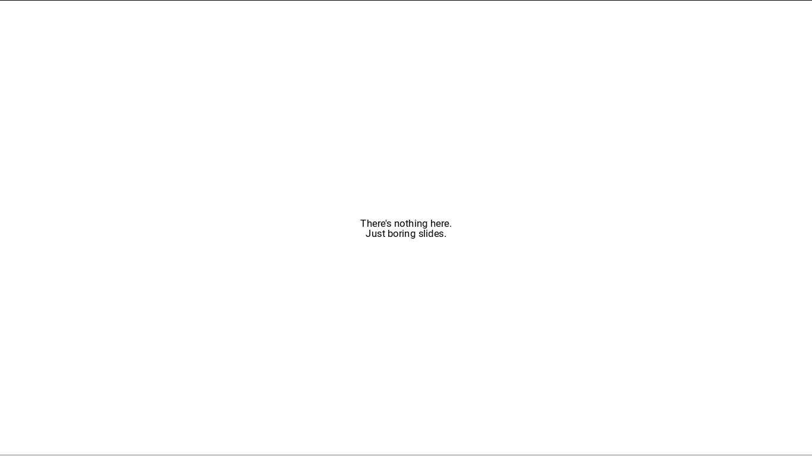

reveal-init
===========

`reveal-init` is a Shell script :shell: that is used to create a new
[Reveal.js](https://revealjs.com) presentation project. More specifically, it
copies necessary files from an existing clone of the Reveal.js repository on
your computer into a new directory.

> More information can be found in [the wiki](wiki)

1. [Why?](#thinking-why)
2. [Demos](#sunglasses-just-reveal-init-and-see-what-youve-got)
3. [Features](#sparkles-nice-features)
4. [Usage](#computer-how-to-use-reveal-init)
5. [License](#page_with_curl-license)

:thinking: Why?
---------------

Every time you want to start a Reveal.js presentation project, you probably
have to copy the whole Reveal.js repository, which contains unnecessary files
(e.g. the ones for development, unnecessary themes & plugins) that you'll have
to delete later. `reveal-init` helps you get through that intimidating process.

:sunglasses: Just `reveal-init` and see what you've got
-------------------------------------------------------

### Input:

```shell
reveal-init -t "The State of Being Ordinary" --header _TITLE -f black --plugin zoom-js - ordinary
```

### Output:

```html
<!DOCTYPE html>
<html>
    <head>
        <meta charset="utf-8">
        <meta name="viewport" content="width=device-width, initial-scale=1.0, maximum-scale=1.0, user-scalable=no">

        <title>The State of Being Ordinary</title>

        <link rel="stylesheet" href="css/reveal.css">
        <link rel="stylesheet" href="css/theme/black.css">
```

```html
    <div class="reveal">
        <div class="slides">
            <section>
                <h1>The State of Being Ordinary</h1>
            </section>
        </div>
    </div>

    <script src="lib/js/head.min.js"></script>
    <script src="js/reveal.js"></script>

    <script>
        Reveal.initialize({
            dependencies: [
                { src: 'plugin/zoom-js/zoom-js.js' },
            ]
        });
    </script>
```


- - -

### Input:

```shell
reveal-init --header "My Point of View" -f sky --plugin notes notes-server - --short-tab my_view
```

### Output:

```html
<!DOCTYPE html>
<html>
  <head>
    <meta charset="utf-8">
    <meta name="viewport" content="width=device-width, initial-scale=1.0, maximum-scale=1.0, user-scalable=no">

    <title></title>

    <link rel="stylesheet" href="css/reveal.css">
    <link rel="stylesheet" href="css/theme/sky.css">
```

```html
    <div class="reveal">
      <div class="slides">
        <section>
          <h1>My Point of View</h1>
        </section>
      </div>
    </div>

    <script src="lib/js/head.min.js"></script>
    <script src="js/reveal.js"></script>

    <script>
      Reveal.initialize({
        dependencies: [
          { src: 'plugin/notes/notes.js' },
          { src: 'plugin/notes-server/notes-server.js' },
        ]
      });
    </script>
```


- - -

### Input:

```shell
reveal-init -t "On Serif | John Doe" --header "Serif on the Web" -theme serif -n 12 --short-tab serif
```

### Output:

```html
    <title>On Serif | John Doe</title>

    <link rel="stylesheet" href="css/reveal.css">
    <link rel="stylesheet" href="css/theme/serif.css">
```

```html
      <div class="slides">
        <section>
          <h1>Serif on the Web</h1>
        </section>
        <section>
        </section>
        <section>
        </section>
        <section>
        </section>
        <section>
        </section>
```

```html
    <script>
      Reveal.initialize();
    </script>
```


- - -

### Input:

```shell
reveal-init -t "Evolution of Computer Graphics" --header _TITLE -f league --plugin notes notes-server zoom-js - computer_graphics
```

### Output:

```html
        <title>Evolution of Computer Graphics</title>

        <link rel="stylesheet" href="css/reveal.css">
        <link rel="stylesheet" href="css/theme/league.css">
```

```html
        <div class="reveal">
            <div class="slides">
                <section>
                    <h1>Evolution of Computer Graphics</h1>
                </section>
            </div>
        </div>

        <script src="lib/js/head.min.js"></script>
        <script src="js/reveal.js"></script>

        <script>
            Reveal.initialize({
                dependencies: [
                    { src: 'plugin/notes/notes.js' },
                    { src: 'plugin/notes-server/notes-server.js' },
                    { src: 'plugin/zoom-js/zoom-js.js' },
                ]
            });
        </script>
```


- - -

### Input:

```shell
reveal-init -t "Boring slides | Boring Inc." --header "There's nothing here.<br>Just boring slides." boring
```

### Output:

```html
        <title>Boring slides | Boring Inc.</title>

        <link rel="stylesheet" href="css/reveal.css">

        <!-- Theme used for syntax highlighting of code -->
        <link rel="stylesheet" href="lib/css/zenburn.css">
```

```html
        <div class="reveal">
            <div class="slides">
                <section>
                    <h1>There's nothing here.<br>Just boring slides.</h1>
                </section>
            </div>
        </div>

        <script src="lib/js/head.min.js"></script>
        <script src="js/reveal.js"></script>

        <script>
            Reveal.initialize();
        </script>
```



:sparkles: Nice features
------------------------

1. :gift: Give your `index.html` a `<title>`
2. :exclamation: Make a big header for your presentation
3. :art: Import 0, 1, or many themes
4. :gear: Import plugins too
5. :bowtie: 2-space tabs or 4-space tabs

:computer: How to use `reveal-init`
-----------------------------------

1. [Get it](https://github.com/NOVAglow/reveal-init/releases).
2. Get a clone of [Reveal.js's repository](https://github.com/hakimel/reveal.js)
(e.g. with `git clone https://github.com/hakimel/reveal.js`). You can also get
a clone of a fork of it.
3. Set `$REVEAL_PATH` to the absolute path of the clone on your computer.
4. Put `reveal-init` into a PATH directory (e.g. `/usr/bin`, `/usr/local/bin`,
`~/.local/bin`) .
5. Run `reveal-init ?` to learn how to use it.
6. Start sprinkling magic. :sunglasses:

For more information, please consult
[the `reveal-init` wiki](wiki).

:page_with_curl: License
------------------------

Licensed under [The Unlicense](http://unlicense.org/). This means `reveal-init`
belongs to the Public Domain. From the license text:

> This is free and unencumbered software released into the public domain.
>
> Anyone is free to copy, modify, publish, use, compile, sell, or
> distribute this software, either in source code form or as a compiled
> binary, for any purpose, commercial or non-commercial, and by any
> means.

